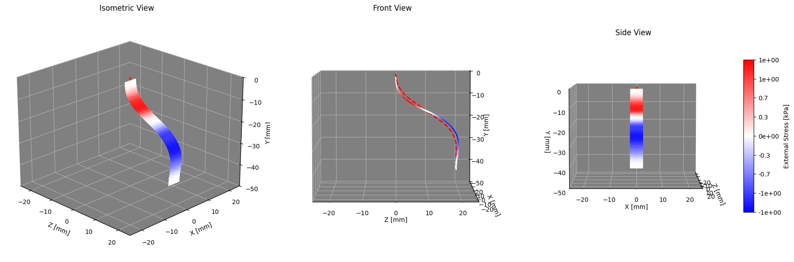
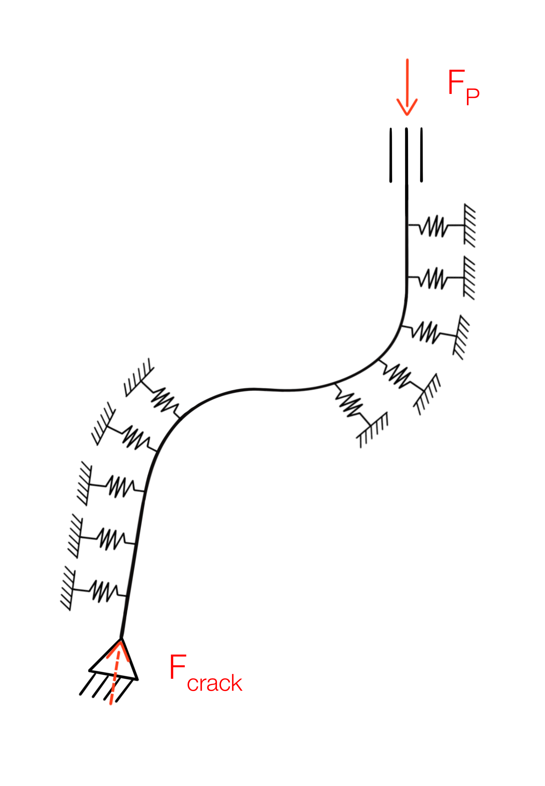

# Ribbon Interaction Simulation

A modified [PyElastica](https://github.com/GazzolaLab/PyElastica) framework to simulate an elastic ribbon-shaped probe inserted along a planned path in soft tissue. It estimates the internal stresses in the ribbon and the contact work performed on the tissue, which can be used to compare candidate paths.



## Overview

The ribbon is modeled with the one-dimensional ribbon model of Audoly & Neukirch, implemented as a Cosserat-rod-based class in PyElastica. The surrounding tissue is represented by a static ribbon-shaped object (the *sleeve*) that applies reaction forces and torques to the ribbon. The tissue response comes from 2D finite element (COMSOL) simulations of a ribbon cross-section in a crack in hyperelastic tissue.

A path is discretized into a sequence of target tip poses. Each step is solved as an independent quasi-static simulation, so all steps can be run in parallel.

## Key Features

- **1D ribbon model**: Audoly–Neukirch model (nonlinear bending/twist constitutive law from plate theory), validated against AUTO-07P solutions.
- **FEM-based tissue interaction**: force–displacement and torque–angle relations from 2D COMSOL simulations, applied per unit length along the ribbon through the `Sleeve` object.
- **Quasi-static path analysis**: each path step is relaxed to static equilibrium under a prescribed tip pose and an axial pushing force controlled to match the crack-propagation force.
- **Parallel by design**: path steps are independent, so a full path can be evaluated in minutes on a cluster.

## Installation

Requires Python ≥ 3.10 (needed by the pinned numpy/scipy versions).

| Package    | Version |
|------------|---------|
| numpy      | 2.2.6   |
| scipy      | 1.15.3  |
| matplotlib | 3.10.3  |
| numba      | 0.61.2  |
| plotly     | 6.1.1   |
| pandas     | 2.2.3   |
| tqdm       | 4.67.1  |
| kaleido    | 0.2.1   |

```bash
git clone https://github.com/pierremaillar/Pyelastica-ribbon-interaction-model-path-planning.git
cd Ribbon_path_planning_tissue_interaction_pyelastica
pip install -U -r requirements.txt
```

There is no separate installation step: the modified PyElastica is run directly from source.

## Repository Structure

<!-- TODO: check this against the actual repository layout -->

```
elastica/                      Modified PyElastica source (based on v0.3.2.post1)
  rod/                         Rod and ribbon classes (ribbon1D.py, linear_ribbon1D.py, ...)
  memory_block/                Contiguous memory allocation for each object type
  surface/                     Plane and Sleeve classes
  contact_forces.py            Contact classes (incl. RibbonSleeveContact)
  _contact_functions.py        Numba-accelerated contact force/torque functions
  external_forces.py           Forcing classes (incl. controlled pushing force)
  src_plotting_ribbon.py       Visualization and post-processing helpers
create_sim_env.py              Wrappers to build the simulation environment
run_*.py                       Entry points defining simulation parameters
*.ipynb                        Tutorial notebooks (see below)
```

The objects in `elastica/rod` follow the architecture of the older PyElastica version used in Tekinalp et al. (PNAS, 2024), while the rest of the code follows PyElastica v0.3.2.post1.

## Usage

### Tutorial notebooks

| Notebook | Content |
|----------|---------|
| `Noto_guide_Auto.ipynb` | Generating reference solutions with AUTO-07P, used to validate the ribbon model |
| `Noto_elastica_ribbon_model.ipynb` | Setting up and running the ribbon model on simple load cases |
| `Noto_elastica_sleeve_interaction.ipynb` | Adding the tissue interaction with the `Sleeve` object (one quasi-static step) |
| `Noto_elastica_full_trajectory.ipynb` | Analyzing a full path |

### Scripts

- `create_sim_env.py`: builds the simulation environment (ribbon, sleeve, contact, constraints, forcing, damping, callbacks).
- `run_*.py`: define the input parameters and launch a simulation.

### Example workflow

1. Set the simulation parameters in a `run_*.py` script (ribbon geometry and material, path, crack-propagation force, damping, end time).
2. Run it: `python run_*.py`
3. Analyze the results with the visualization tools used in the notebooks.

## How the Quasi-static Simulation Works

PyElastica is a dynamic solver, so a static equilibrium is obtained by relaxation:

- **Initialization in the sleeve configuration**: the ribbon starts along the planned path, close to the expected equilibrium, which reduces transients.
- **Increased inertia**: the ribbon density is multiplied by 100 to stabilize the explicit time integration. This does not affect the static solution.
- **Damping**: an analytical linear damper, tuned to be slightly underdamped, dissipates energy quickly.
- **Kirchhoff assumptions approximated**: shear/stretch stiffness is set to about 100× the bending stiffness to approximate an inextensible, unshearable centerline.
- **Boundary conditions**: the tip is clamped at the target pose of the step, and the base slides along the insertion axis.
- **Force control**: a proportional controller adjusts the axial pushing force at the base so that the force at the tip converges to the crack-propagation force.
- **Convergence**: the end time is tuned manually. Check that the tip force has converged, that positions and directors no longer evolve, and that shear/stretch strains remain negligible.




## Tissue Interaction (Sleeve)

The `Sleeve` object has the same centerline, frame, width and thickness definition as the ribbon and represents the crack opened along the path. For each ribbon element:

- the indentation depth is the relative displacement projected on the sleeve normal;
- the twist and bend angles are computed from the projection of the sleeve normal onto the ribbon frame;
- the force and torque are obtained by evaluating the fitted FEM relations (per unit length) and multiplying by the element length, so results do not depend on element size.

See the user guide for the full variable list and the limitations of the model.

## Limitations

- The tissue is treated as homogeneous and isotropic, with a fixed crack length. Crack propagation is represented only through the prescribed tip force.
- The 3D interaction is approximated by a 2D problem applied independently to each element, which is valid for smooth deformations (small curvature and tissue deformation).
- Indentation and twist were characterized separately, so their coupling is neglected. Tangential interactions (friction) are not modeled.
- Twist and bend angles are computed from the sine of projected cross products, which is only reliable for moderate angles.
- Convergence to equilibrium relies on a manually tuned end time. There is no automatic stopping criterion.
- Explicit time integration requires small time steps.

## Documentation

For detailed technical documentation, see the user guide (`User_guide_elastica_ribbon_interaction.pdf`).

## Citation

If you use this code, please cite:

<!-- TODO: add the reference of the paper once available -->

and the works it builds on:

> Audoly, B., & Neukirch, S. (2021). A one-dimensional model for elastic ribbons: A little stretching makes a big difference. *Journal of the Mechanics and Physics of Solids*, 153, 104457. https://doi.org/10.1016/j.jmps.2021.104457

> Tekinalp, A., Kim, S. H., Bhosale, Y., Parthasarathy, T., Naughton, N., Albazroun, A., ... & Gazzola, M. (2024). GazzolaLab/PyElastica: v0.3.2 (Version v0.3.2). Zenodo. https://doi.org/10.5281/zenodo.10883271

> Gazzola, M., Dudte, L. H., McCormick, A. G., & Mahadevan, L. (2018). Forward and inverse problems in the mechanics of soft filaments. *Royal Society Open Science*, 5, 171628. https://doi.org/10.1098/rsos.171628

> Tekinalp, A. et al. (2024). Topology, dynamics, and control of a muscle-architected soft arm. *PNAS*. https://doi.org/10.1073/pnas.2318769121

## License

<!-- TODO: add a license (PyElastica is MIT-licensed; check compatibility) -->

## Contact

- **Author**: Pierre Maillard, <pierre.maillard@epfl.ch>
- **Supervisor**: Lorenzo Noseda, <lorenzo.noseda@epfl.ch>

---

⚠️ **Note**: This is research-grade software. Validate results carefully and consider the documented limitations for your specific use case.